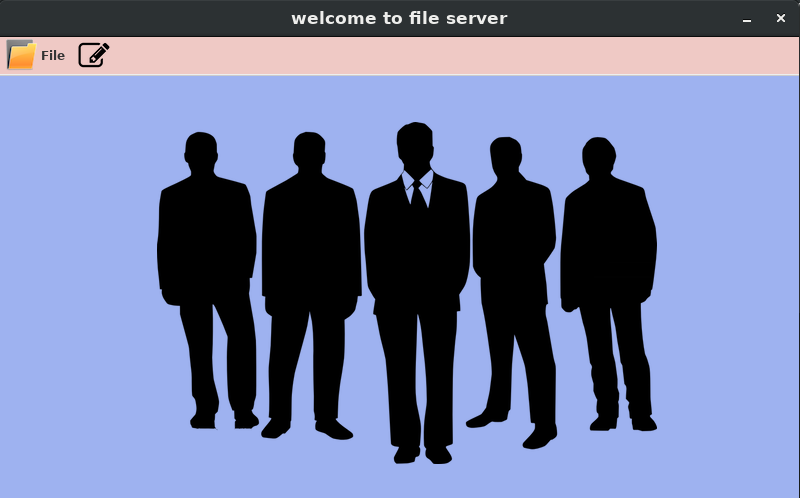
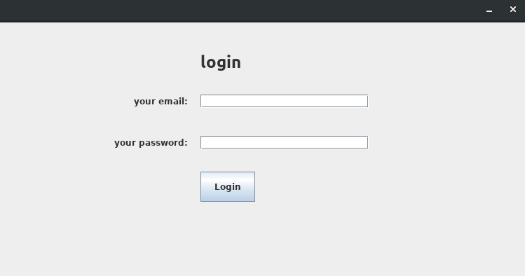
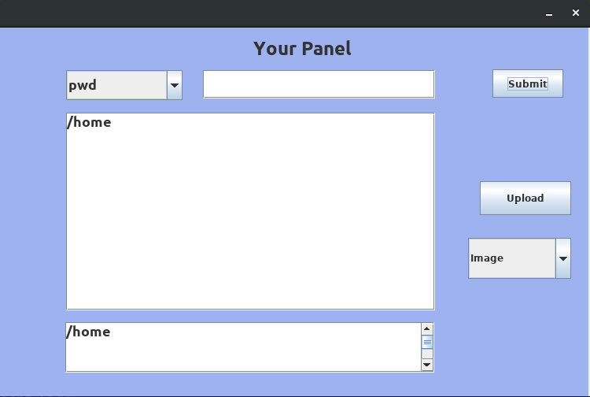

# File_Server_GUI_Java
it is a project which shows how to connect two computers with each others and on of them act as a client and the other act as a client 


# video in arabic
https://www.youtube.com/watch?v=jTTFWyc2-Gw&feature=youtu.be




# requirements:
### java
### netbeans IDE
### operating system (windows 10 or ubunut 18.04 LTS)
### WIFI or Ethernet





# config

### 1- after downloading, you will have source code (%server & %client).

### 2- you need to put (ip address of server computer) in a client computer and connect them with the same WiFi like 
### in ```bash s =  new Socket("192.168.43.208", 1234); ``` change ```192.168.43.208``` to ```127.0.0.1```.

### 3- you need to config the path in server code to make operations.

### 4- put the path where you want to store client there in ```bash Home.java ``` , 
### you need to change path and put yours to disk D: or E: for example, put this new path
### in function ```bash getCwd() ``` 

### 5- run server code first,

### 6- then run client code after that.

